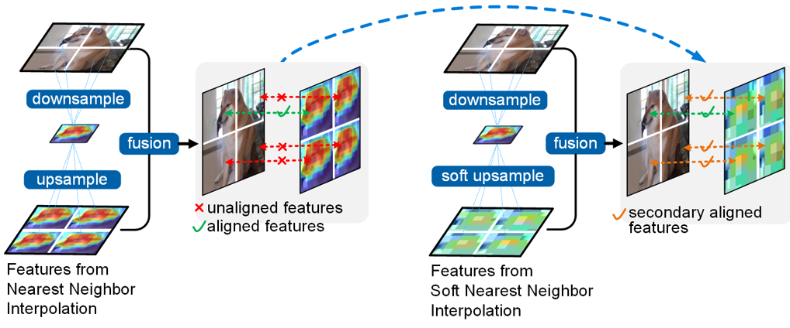

# ECCV 2024: [Rethinking Features-Fused-Pyramid-Neck for Object Detection](https://eccv.ecva.net/virtual/2024/poster/1537)
(事实上我想把这个工作称为 _Slim Neck V2_. 因为这是我继 [_Slim Neck by GSConv_](https://github.com/AlanLi1997/slim-neck-by-gsconv) 后的工作😀)
我会在10月和11月份尽快发布关键代码.

小彩蛋 - Cheems(Balltze)。23年初，在我对“特征融合”范式进行反思并计划进行深入研究时，Cheems开始频繁地出现在我的社交软件中。我很喜欢它的样子，每次看到它我都能获得一些快乐的能量，但是它在我还没完成这篇论文时就已经去了另一个世界。我把它最令我印象深刻的样子放在了论文中的主要图解中来纪念它。感谢像Cheems这样的可爱的小动物们治愈我们的心灵。

  

