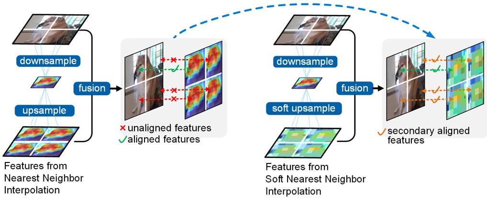

# ECCV 2024: [Rethinking Features-Fused-Pyramid-Neck for Object Detection](https://link.springer.com/chapter/10.1007/978-3-031-72855-6_5)

[English](README.md) | [简体中文](README-zh-CN.md)| [Paper PDF](https://www.ecva.net/papers/eccv_2024/papers_ECCV/papers/08386.pdf)

(I would like to call it _Slim Neck V2_. V1 is the [_Slim Neck by GSConv_](https://github.com/AlanLi1997/slim-neck-by-gsconv).😀)

Balltze's birthday is November 6th. We plan to release the code on November 16th, ten days after its birthday.

A little easter egg - Cheems(Balltze). At the beginning of 2023, when I was reflecting on the "feature fusion" paradigm and planning to conduct in-depth research, Cheems started appearing frequently on my social media. I really liked it, and every time I saw it, I felt a surge of joy. However, it had left this world before I could finish this paper. To commemorate it, I included its most memorable image in the main illustration of my paper. I am grateful for cute little animals like Cheems, who heal our hearts.
<p align="center">
  
</p>

**Absract**<br />
Multi-head detectors typically employ a features-fused-pyramid-neck for multi-scale detection and are widely adopted in the industry.
However, this approach faces feature misalignment when representations from different hierarchical levels of the feature pyramid are forcibly fused point-to-point.
To address this issue, we designed an independent hierarchy pyramid (IHP) architecture to evaluate the effectiveness of the features-unfused-pyramid-neck for multi-head detectors.
Subsequently, we introduced soft nearest neighbor interpolation (SNI) with a weight-downscaling factor to mitigate the impact of feature fusion at different hierarchies while preserving key textures.
Furthermore, we present a feature adaptive selection method for downsampling in extended spatial windows (ESD) to retain spatial features and enhance lightweight convolutional techniques (GSConvE).
These advancements culminate in our secondary features alignment solution (SA) for real-time detection, achieving state-of-the-art results on Pascal VOC and MS COCO.

[comment]: <> (<p align="center">)

[comment]: <> (  )

[comment]: <> (</p>)

## Prepare datasets&environment
1.datasets
```
├── rethinking-fpn
│   ├── datasets
│   │   ├── coco
│   │   │   ├──images
│   │   │   │  ├──1.jpg
│   │   │   │  ├──...
│   │   │   ├──labels
│   │   │   │  ├──1.txt
│   │   │   │  ├──...
│   │   ├──VOC...
```
2.environment

    pip install requirements.txt
test environment for working:<br />
python==3.8.16<br />  pytorch==1.12.0(py3.8_cuda11.3_cudnn8.3.2_0)<br /> torchvision==0.13.0(py38_cu113)<br />


## Train_sn2yolo models
    python ./slimneck_v2/for_yolo/sn2-yolov5-v8/train_sn2yolo.py

## Train_sn2fpn(R-CNN) models
    python train_sn2fpn.py

## Validation_sn2yolo models
    python ./slimneck_v2/for_yolo/sn2-yolov5-v8/val_sn2yolo.py


 ## References
  - https://github.com/AlanLi1997/slim-neck-by-gsconv
  - https://github.com/ultralytics/ultralytics
  - https://github.com/jwyang/fpn.pytorch
  - https://github.com/WongKinYiu/yolov7


## Citation
@inproceedings{re-fpn,<br />
  title={Rethinking Features-Fused-Pyramid-Neck for Object Detection},<br />
  author={Li, Hulin},<br />
  editors={Leonardis, A., Ricci, E., Roth, S., Russakovsky, O., Sattler, T., Varol, G.}<br />
  booktitle={Computer Vision – ECCV 2024. ECCV 2024. Lecture Notes in Computer Science, vol 15125.},<br />
  pages={74-90},<br />
  year={2024},<br />
  publisher={Springer, Cham.}, <br />
  doi={10.1007/978-3-031-72855-6_5}, <br />
}